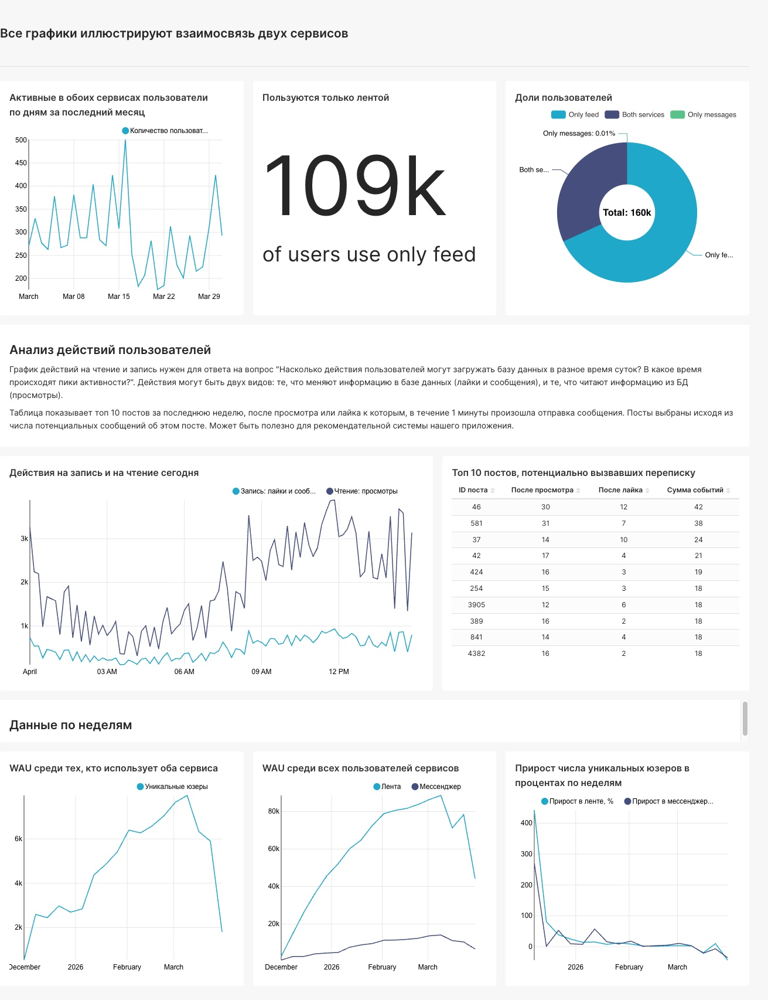
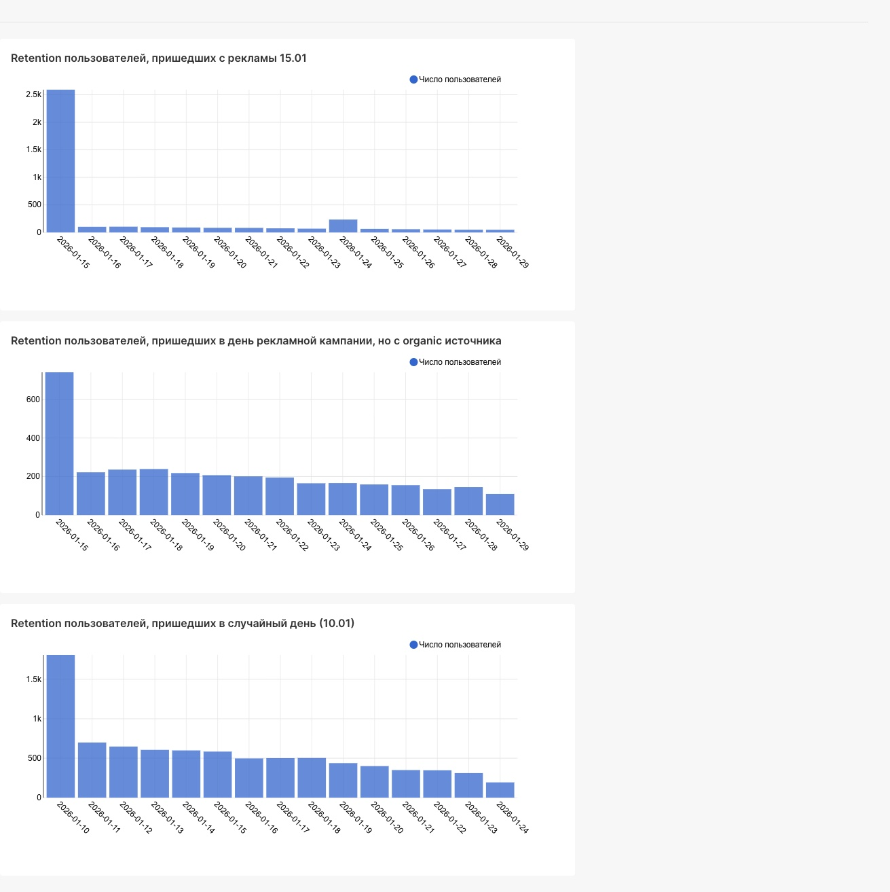
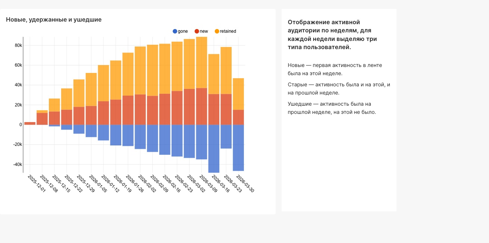

# Дэшборд связи мессенджера и ленты 

Задача: cоставить дашборд, который описывает взаимодействие двух сервисов одного приложения — ленты и сообщений. 

 

# Визуализации, анализирующие успешность рекламной кампании 

Маркетологи провели крупную рекламную кампанию 15 января, и в приложение пришло много новых пользователей.
Задача: Проанализировать характер Retention пользователей, привлечённых рекламной кампанией. Что стало с рекламными пользователями в дальнейшем, как часто они продолжают пользоваться приложением?

Из графика retention для пользователей с органических источников, пришедших в день проведения рекламной кампании, и графика retention всех пользователей, пришедших в случайный день (я выбрала 10 января), можно сделать вывод, что на 2 день число зашедших пользователей снижается в 2-3 раза, а в дальнейшем колеблется у одного показателя с постепенным "затуханием". График пользователей, привлеченных рекламой 15.01, сильно отличается от этих двух. На второй день в приложение не зашло 96% пользователей с рекламы. Оставшиеся 4% продолжили использование, причем довольно типичным образом - с колебанием вокруг одного показателя. 
Вероятные причины: 
1) реклама была направлена на слишком широкую аудиторию, в массе не на целевую аудиторию приложения, большинство пришедших люди просто не увидели ценности пользоваться приложением 
2) реклама была "кликбейтной", возможно, люди регистрировались, чтобы получить какую-то выгоду и удаляли приложение после
3) реклама сформировала ожидания, которые не подтверждались пользовательским опытом, например, приложение оказалось запутанным или нетипичным в своем сегменте, или лента требовала персонализации и донастройки.

 

# График новых, старых и ушедших пользователей 

Данные за каждую неделю с момента создания приложения. 

   

Авторство заданий принадлежит Karpov.Courses  
Курс Симулятор аналитика: https://karpov.courses/simulator 