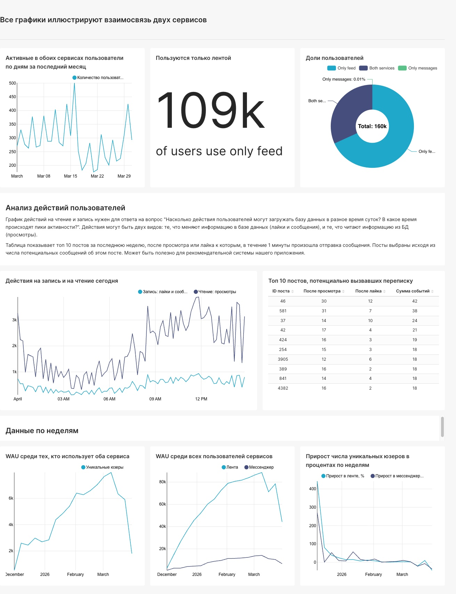
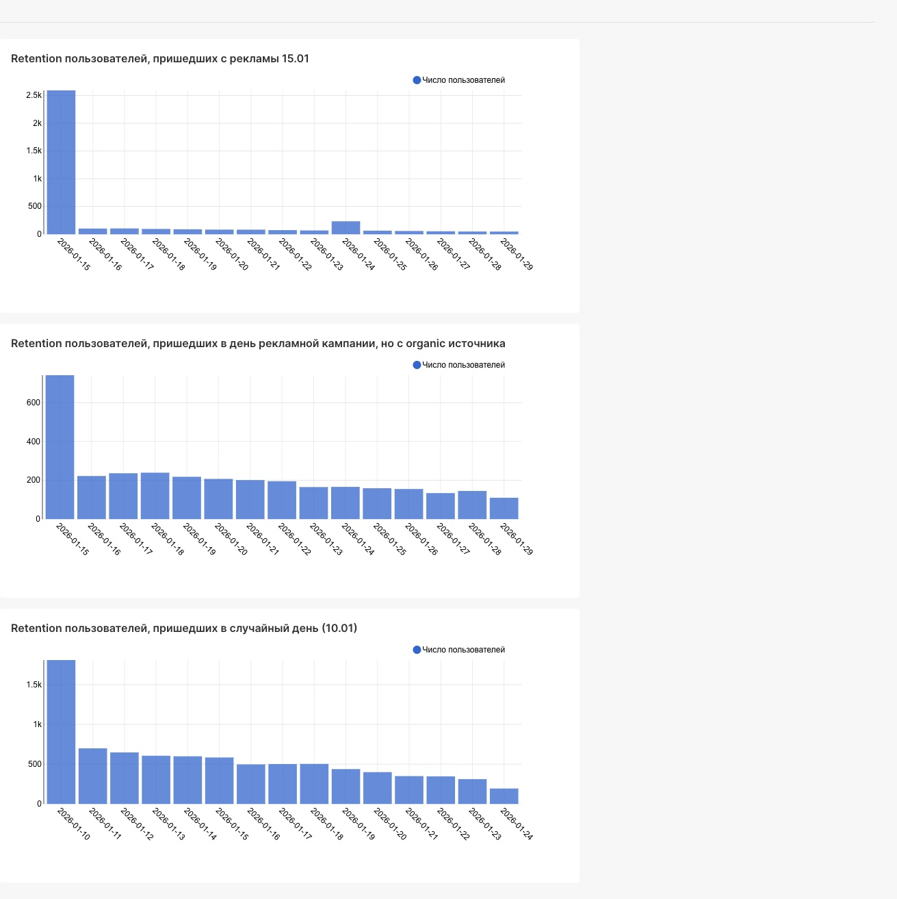
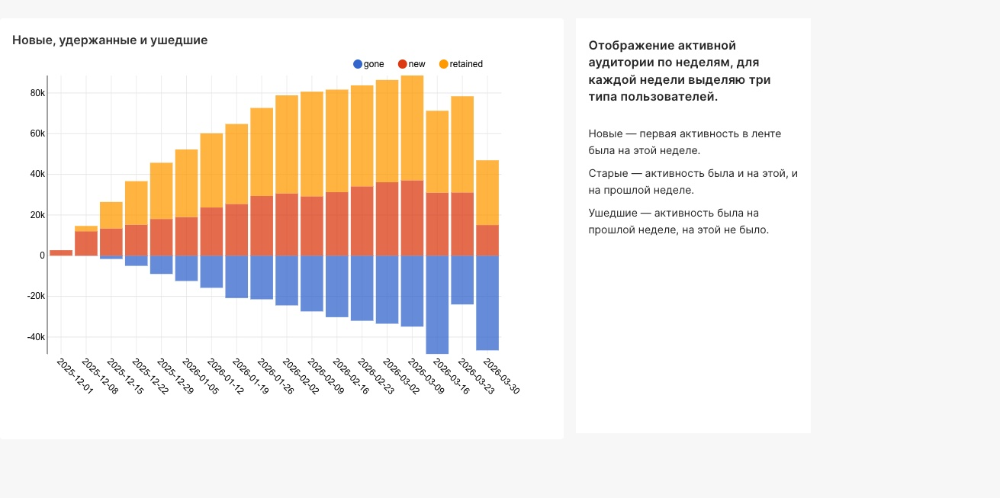

# Дэшборд связи мессенджера и ленты 

Построен дашборд, описывающий взаимодействие пользователей между двумя сервисами приложения.
Отображаются:
- аудитория ленты
- аудитория мессенджера
- пересечение пользователей
- недельные метрики
- активность пользователей
- наиболее обсуждаемые посты

 

# Анализ retention после рекламной кампании

Маркетинговая кампания привела большое количество новых пользователей 15 января 2026 года.

Построены графики retention для:
- пользователей из рекламы
- органических пользователей того же дня
- пользователей случайной даты

Основные выводы: 
1) после рекламы около 96% пользователей не вернулись уже на следующий день 
2) оставшиеся пользователи демонстрировали привычный профиль удержания 

Возможные причины:
- нецелевая аудитория
- завышенные ожидания от рекламы 
- регистрация ради разового бонуса

 

# График новых, старых и ушедших пользователей 

Для каждой недели пользователи разделены на категории: новые, удержанные, ушедшие.
Это позволяет оценивать динамику роста аудитории и уровень удержания продукта.

   

Авторство заданий принадлежит Karpov.Courses  
Курс Симулятор аналитика: https://karpov.courses/simulator 