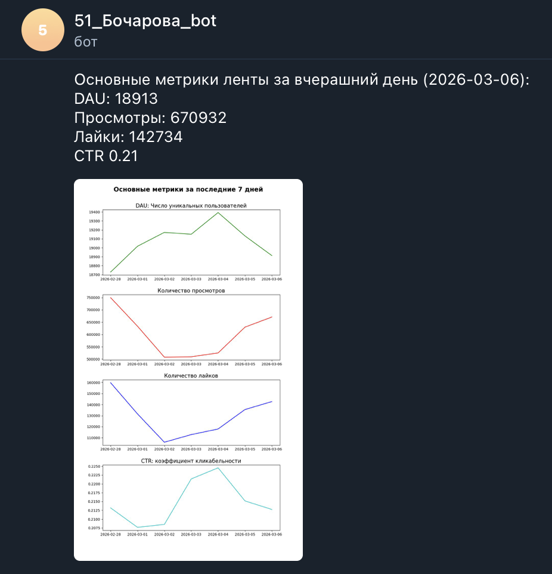

# Автоматизация отчетности в Telegram

Цель: 
Автоматизировать ежедневную отправку продуктовых метрик в Telegram с помощью Airflow. DAG извлекает данные из ClickHouse, формирует текстовый отчет и строит графики динамики ключевых показателей за последнюю неделю.

В отчет входят: 
- DAU
- просмотры
- лайки
- CTR
- графики динамики за последние 7 дней

Особенности: 
1) ежедневический запуск DAG
2) автоматическая генерация визуализаций
3) отправка текста и изображений через Telegram Bot API

 

   

Авторство задания принадлежит Karpov.Courses  
Курс Симулятор аналитика: https://karpov.courses/simulator 