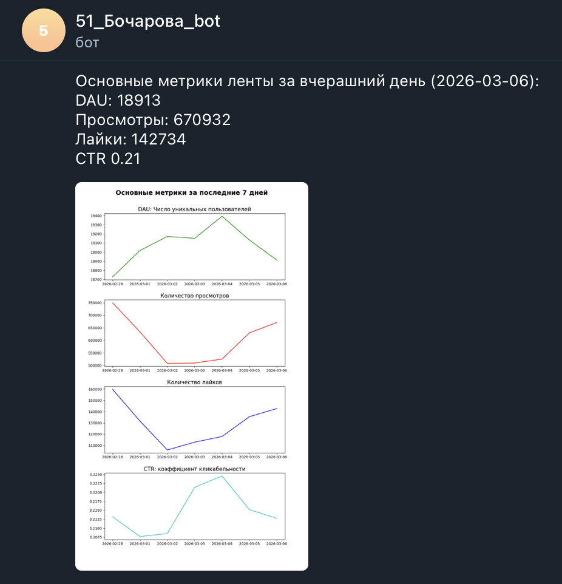

# Автоматизация отчетности в Telegram

Задача: с помощью Airflow автоматизировать отправку в Telegram отчетности о базовых метриках приложения, состоящего из мессенджера и ленты. Отчетность состоит из текста и графиков.

 

   

Авторство задания принадлежит Karpov.Courses  
Курс Симулятор аналитика: https://karpov.courses/simulator 